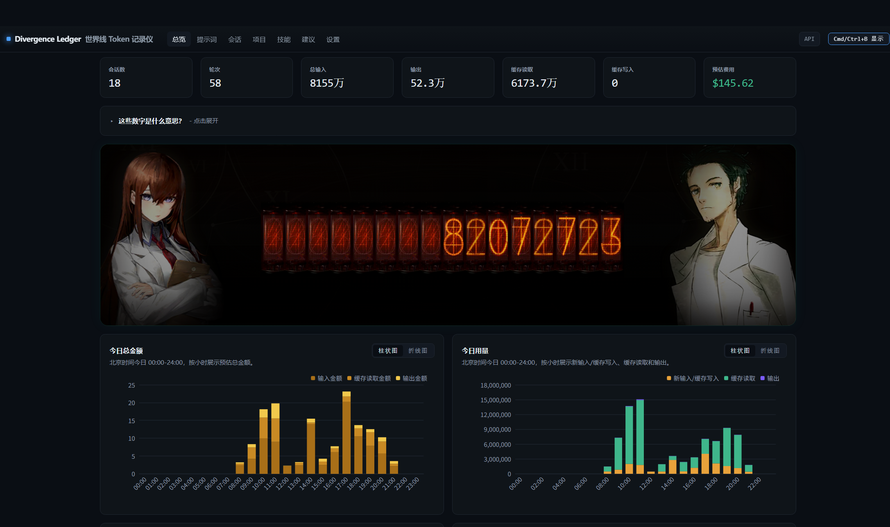

# Steins;Gate Token Dashboard

<p align="center"><strong>English</strong> · <a href="README.md">简体中文</a></p>

## Steins;Gate Token Usage Dashboard

A local, offline Claude Code and Codex token usage dashboard inspired by the world lines of *Steins;Gate*. It reads JSONL session records stored on your machine and shows token usage, cache activity, estimated cost, projects, and sessions so you can answer one question: **where are my tokens going?**

> **Unofficial disclaimer:** This is an unofficial, non-commercial fan-made derivative. Steins;Gate names, characters, and related visual assets belong to their respective rights holders. This project is not affiliated with or endorsed by the rights holders.



## Origin

This project is a modified derivative of [`nateherkai/token-dashboard`](https://github.com/nateherkai/token-dashboard). It keeps the upstream local dashboard, JSONL scanner, SQLite cache, session analysis, and MIT license. Many thanks to the upstream project for providing a clear foundation.

## Features

- **Overview**: total input, output, cache reads, cache writes, sessions, turns, and estimated cost.
- **Prompts**: expensive prompts ranked by tokens, with responses, tool calls, and tool-result sizes.
- **Sessions**: turn-by-turn inspection with model, token buckets, and tool calls.
- **Projects**: token, session, and touched-file comparisons across projects.
- **Skills**: Claude Code / Codex skill invocation counts and estimated skill-definition tokens.
- **Tips**: token-saving suggestions based on repeated reads, large tool results, and low cache-hit rates.
- **Settings**: cost display modes for API, Pro, Max, and Max 20x plans.
- **Steins;Gate theme**: world-line counter, character visuals, and divergence-meter-style token display.
- **Privacy mode**: blur prompts, project names, session identifiers, and tips in the UI.

## Improvements over upstream

The accounting logic has been refined for real-world session records:

- Deduplicates by real threads, stable event keys, `call_id`, `client_id`, and message identifiers to avoid double counting.
- Removes the 2–3 streaming snapshots often written for one assistant message and keeps the final tally.
- Separates ordinary input, cache reads, 5-minute cache writes, 1-hour cache writes, output, and reasoning-output tokens; reasoning output is an output subset and is never added twice.
- Supports long-context multipliers and UTC-based historical pricing, so old usage is not recalculated with today’s rates.
- Scans Codex and Claude Code skill directories, estimates recursive tool-result tokens, and marks unassigned results explicitly.
- Adds project, model, session, prompt, skill, tool, cache, and data-quality audit views.
- Remains stdlib-only, telemetry-free, login-free, and local-only.

## Quick start

Requirements: Python 3.8+, at least one Claude Code or Codex session, and a modern browser. No `pip install`, Node.js, or build step is required.

```bash
git clone https://github.com/Vesper-lucky/steins-gate-token-dashboard.git
cd steins-gate-token-dashboard
python3 cli.py dashboard
```

The first run scans `~/.claude/projects/` and starts the local dashboard at `http://127.0.0.1:8081`. Stop it with `Ctrl+C`. On Windows, use `py -3` instead of `python3` if needed.

Common commands:

```bash
python3 cli.py scan          # scan and refresh the local SQLite cache
python3 cli.py today         # show today's totals in Beijing time
python3 cli.py stats         # show all-time totals
python3 cli.py tips          # show token-saving suggestions
python3 cli.py audit         # show data-quality and conservation checks
python3 cli.py dashboard --no-open
```

## Data sources and configuration

Claude Code stores sessions at:

| OS | Default path |
| --- | --- |
| macOS / Linux | `~/.claude/projects/<project-slug>/<session-id>.jsonl` |
| Windows | `C:\Users\<you>\.claude\projects\<project-slug>\<session-id>.jsonl` |

The Codex bridge can convert local Codex records into the same dashboard input format. The scanner only reads these files and never modifies them. The SQLite cache defaults to `~/.claude/token-dashboard.db`.

Available environment variables:

| Variable | Default | Purpose |
| --- | --- | --- |
| `HOST` | `127.0.0.1` | Local bind address. Do not change it to `0.0.0.0` unless you understand the network risk. |
| `PORT` | `8081` | Local server port. |
| `CLAUDE_PROJECTS_DIR` | `~/.claude/projects` | Claude JSONL root directory. |
| `TOKDASH_PROJECTS_DIRS` | unset | Multiple session roots separated by `os.pathsep`. |
| `TOKEN_DASHBOARD_DB` | `~/.claude/token-dashboard.db` | SQLite cache path. |

### Adding model prices manually

Pricing lives in [`pricing.json`](pricing.json). The model key must exactly match the `message.model` value in your logs. Prices are USD per 1,000,000 tokens:

```json
{
  "models": {
    "your-model-name": {
      "tier": "custom",
      "input": 1.0,
      "output": 5.0,
      "cache_read": 0.1,
      "cache_create_5m": 1.25,
      "cache_create_1h": 1.25
    }
  }
}
```

Reload the page after editing the file. Add a `history` array with UTC `before` timestamps for historical rates. Add `long_context_threshold`, `long_context_input_multiplier`, and `long_context_output_multiplier` for long-context pricing. You can ask an AI to draft the JSON from the model’s official pricing page, but manually verify the model name, cache rates, currency, and effective time. Unknown models still show token counts, while their cost is marked unknown or estimated.

## Privacy and security

- All processing happens locally; there is no telemetry, login, or API that uploads your sessions.
- The default bind address is `127.0.0.1`. Setting `HOST=0.0.0.0` can expose your prompt history to other devices on the network.
- The repository does not include real JSONL sessions, SQLite databases, `.env` files, personal paths, keys, or passwords.
- `.gitignore` keeps only sanitized samples under `tests/fixtures/` for parser and accounting tests.
- Browser assets are served from the repository and do not depend on a font CDN or remote analytics script.

## Testing and development

```bash
python3 -m unittest discover tests
node --test tests/*.test.mjs
```

The project uses the Python standard library, SQLite, `http.server`, vanilla JavaScript, and a vendored ECharts build. No frontend build tool is required. The data flow is `cli.py` → `token_dashboard/scanner.py` → SQLite → `token_dashboard/server.py` → `web/`.

## Assets and disclaimer

Steins;Gate characters and related visual assets in this repository are used in an unofficial, non-commercial fan-made derivative. They do not indicate official cooperation, authorization, or endorsement. Characters, trademarks, and the original work remain the property of their respective rights holders.

The source of the digit assets in `web/assets/divergence-meter/` is documented in that directory’s [README](web/assets/divergence-meter/README.md). A source reference is not a copyright license. Rights holders who want an asset adjusted or removed can contact the maintainer through a GitHub issue.

## License

The code is modified from [`nateherkai/token-dashboard`](https://github.com/nateherkai/token-dashboard) under the MIT License; see [`LICENSE`](LICENSE). The MIT license for the code does not grant new rights to the themed characters or third-party visual assets.

## Acknowledgements

- [`nateherkai/token-dashboard`](https://github.com/nateherkai/token-dashboard): upstream dashboard and local token analytics foundation.
- [`longsongline/Steins-Gate-Divergence-Meter-Clock-VisitorCounter`](https://github.com/longsongline/Steins-Gate-Divergence-Meter-Clock-VisitorCounter): source reference for the divergence-meter digit assets.

## Contributors

<table>
  <tr>
    <td align="center" valign="top" width="160">
      <a href="https://github.com/Vesper-lucky">
        <br />
        <sub><b>屿沐 / Vesper-lucky</b></sub>
      </a><br />
      <sub>Project maintainer</sub>
    </td>
    <td align="center" valign="top" width="160">
      <a href="https://openai.com/codex/">
        <br />
        <sub><b>OpenAI Codex</b></sub>
      </a><br />
      <sub>AI coding assistant</sub>
    </td>
  </tr>
</table>

> GitHub’s automatic Contributors sidebar is generated from Git commits linked to real GitHub accounts. The Contributors block above records AI assistance explicitly without pretending that Codex is an independent GitHub account.
